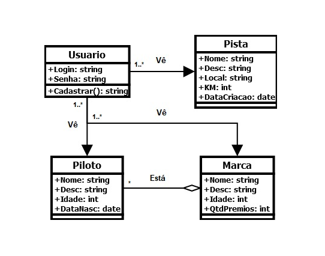

<h1 align=center>SpeedTrack</h1>
<h2>Dupla: Moisés dos Santos Cruz & Yasmim Pereira da Costa</h2>

    O aplicativo mobile "Speed Track" foi desenvolvido com o objetivo de unir a emoção e a paixão pela Fórmula 1 com a conscientização e a promoção da sustentabilidade ambiental. Combinando a alta tecnologia do esporte automobilístico mais prestigiado do mundo com a importância da proteção do meio ambiente, o aplicativo visa informar, engajar e inspirar fãs de corridas a adotarem práticas sustentáveis em suas vidas cotidianas.

<h2>Link para o vídeo: https://youtu.be/rdx6YP3gFFA?si=n7bUrDIFDWlvh1yw</h2>

    
<h1>Principais Características</h1>

    <ul>
        <li align=justify><strong>Informações sobre Sustentabilidade na Fórmula 1:</strong> O aplicativo fornece uma  base de conhecimentos sobre porque os carros são um “perigo” adotados na Fórmula 1, incluindo detalhes sobre emissões significativas de dióxido de carbono (CO2), combustível fóssil, metais, plásticos, borrachas e outros materiais.
        </li>
         
        <li align=justify><strong>Conhecimento:</strong> Os usuários terão acesso para conhecer as pistas mais famosas da fórmula, e conhecer os pilotos que fizeram/estão fazendo história na atualidade. E claro, terão acesso para conhecer os “danos” que a F1 trás à sustentabilidade.
        </li>
         
        <li align=justify><strong>Dicas para um melhor uso dos automóveis:</strong> Ao decorrer das informações e curiosidades apresentadas para o usuário, o aplicativo terá certas áreas onde terá diversos tipos de dicas sobre sustentabilidade ambiental, visando uma proximidade maior com o usuário e uma maior chance de convencer o usuário de que pensar de maneira sustentável vale a pena.
        </li>
    </ul>

Ao criar o aplicativo "Speed Track", nós  acreditamos  que podemos combinar o entusiasmo e interesse da comunidade apaixonada pela Fórmula 1 com um propósito maior - conscientizar sobre a importância da sustentabilidade ambiental e incentivar ações que contribuam para um futuro mais verde e ecologicamente equilibrado. Ao promover uma mentalidade sustentável no contexto do automobilismo de alto nível, esperamos inspirar uma mudança positiva na indústria automobilística e entre os fãs do esporte, tornando a Fórmula 1 uma plataforma não apenas para competição emocionante, mas também para avanços significativos em prol do meio ambiente.

    
<h1>Ficha Técnica</h1>

    <ul>
        <li><strong>Versão do Android:</strong> 8.0 (Oreo);</li>
        <li><strong>Número de Telas:</strong> 7;</li>
        <li><strong>Linguagem de Programação:</strong> Java;</li>
        <li><strong>IDE</strong> Android Studio;</li>
    </ul>

    
<h1>Diagrama de Classe</h1>

    

